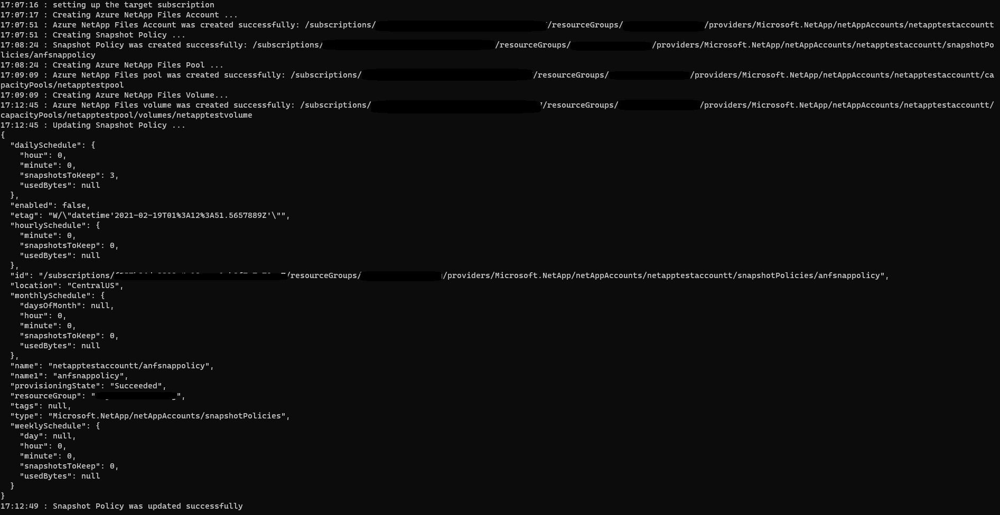

# Azure NetAppFiles script Sample - Snapshot Policy for Azure CLI 

This project demonstrates how to use a PowerShell sample script to create and update a Snapshot Policy for the Microsoft.NetApp
resource provider.

In this sample script we perform the following operations:

* Creations
    * NetApp Files Account
    * Snapshot Policy
    * Capacity Pool
    * Volume
* Updates
    * Snapshot Policy
* Deletions
    * Volume
	* Capacity Pool
    * Snapshot Policy    
    * Account

>Note: The cleanup execution is disabled by default. If you want to run this end to end with the cleanup, please
>change value of string variable 'SHOULD_CLEANUP' in create-anf-snapshot-policy.sh

If you don't already have a Microsoft Azure subscription, you can get a FREE trial account [here](http://go.microsoft.com/fwlink/?LinkId=330212).

## Prerequisites

1. Azure Subscription
1. Subscription needs to be enabled for Azure NetApp Files. For more information, please refer to [this](https://docs.microsoft.com/azure/azure-netapp-files/azure-netapp-files-register#waitlist) document.
1. Resource Group created
1. Virtual Network with a delegated subnet to Microsoft.Netapp/volumes resource. For more information, please refer to [Guidelines for Azure NetApp Files network planning](https://docs.microsoft.com/en-us/azure/azure-netapp-files/azure-netapp-files-network-topologies)
1. Make sure [Azure CLI](https://docs.microsoft.com/cli/azure/install-azure-cli) is installed.
1. Windows with WSL enabled (Windows Subsystem for Linux) or Linux to run the script. This was developed/tested on Ubuntu 18.04 LTS (bash version 4.4.20).
1. Make sure [jq](https://stedolan.github.io/jq/) package is installed before executing this script.

# What is netappfiles-cli-snapshot-policy-script-sample doing? 

This sample is dedicated to demonstrate how to create and update a Snapshot Policy using an ANF Account name in Azure NetApp Files.
ANF Account and then a Snapshot Policy that is tied to that Account. Afterwards it will create a Capacity Pool within the
Account and finally a single Volume that uses the newly created Snapshot Policy.

There is a section in the code dedicated to remove created resources. By default this script will not remove all created resources;
this behavior is controlled by variable called 'SHOULD_CLEANUP' in the create-anf-snapshot-policy.sh file. If you want to erase all resources right after the
creation operations, set this variable to 'true'.
If any of the earlier operations fail for any reason, the cleanup of resources will have to be done manually.

A Snapshot Policy uses schedules to create snapshots of Volumes that can be **hourly**, **daily**, **weekly**, **monthly**.
The Snapshot Policy will also determine how many snapshots to keep.
The sample will create a Snapshot Policy with all schedules and then update a single schedule within the policy, changing
the value of the schedule's snapshots to keep.

# How the project is structured

The following table describes all files within this solution:

| Folder      | FileName                		| Description                                                                                                                         |
|-------------|---------------------------------|-------------------------------------------------------------------------------------------------------------------------------------|
| Root        | create-anf-snapshot-policy.sh   | Authenticates and executes all operations                                                                                           |


# How to run the script

1. Clone it locally
    ```powershell
    git clone https://github.com/Azure-Samples/netappfiles-cli-snapshot-policy-script-sample.git
    ```
1. Open a bash session and execute the following Run the script

	 * Change folder to **netappfiles-cli-snapshot-policy-script-sample\src\**
	 * Open create-anf-snapshot-policy.sh and edit all the parameters
	 * Save and close
	 * Run the following command
	 ``` Terminal
	 ./create-anf-snapshot-policy.sh
	 ```

Sample output


# References

* [Manage snapshots](https://docs.microsoft.com/azure/azure-netapp-files/azure-netapp-files-manage-snapshots)
* [Resource limits for Azure NetApp Files](https://docs.microsoft.com/azure/azure-netapp-files/azure-netapp-files-resource-limits)
* [Azure Cloud Shell](https://docs.microsoft.com/azure/cloud-shell/quickstart)
* [Azure NetApp Files documentation](https://docs.microsoft.com/azure/azure-netapp-files/)
* [Download Azure SDKs](https://azure.microsoft.com/downloads/)
